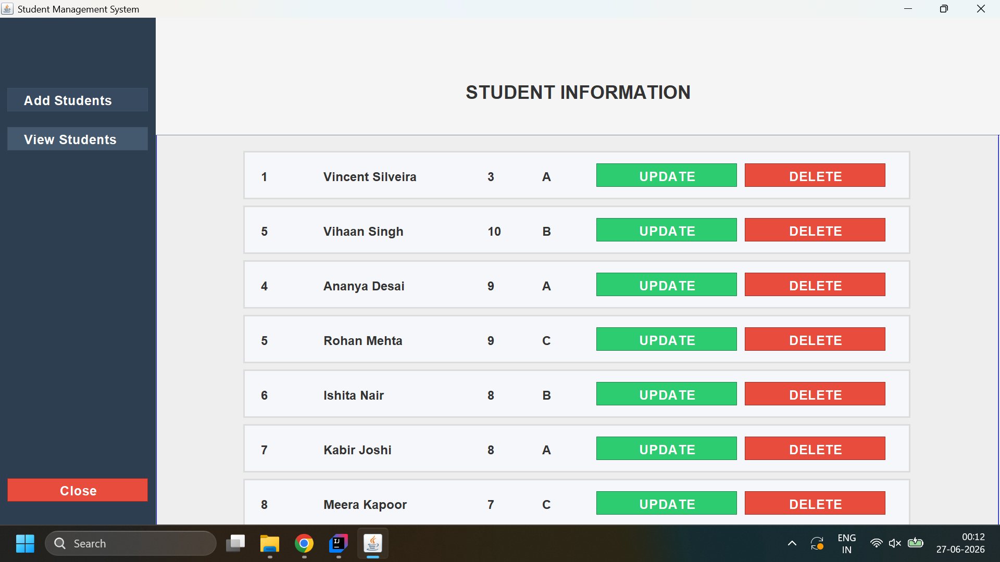
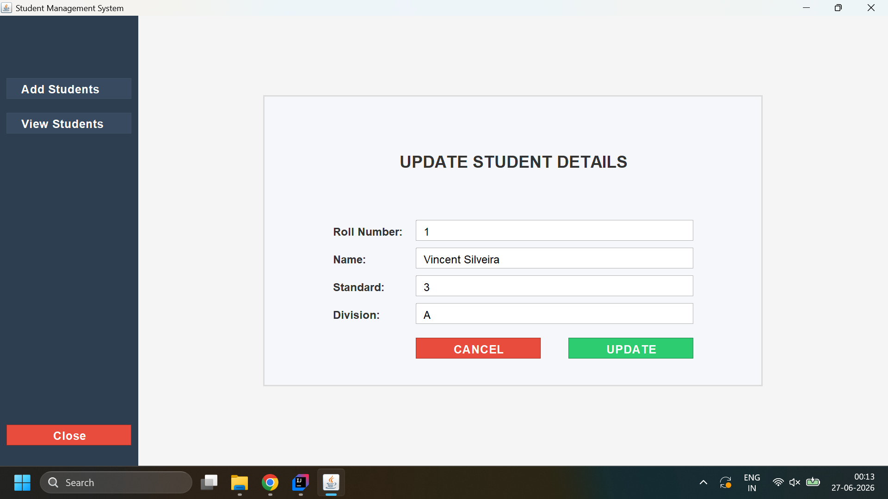

# Student Management System

A desktop-based **Student Management System** developed in **Java Swing** using **JDBC** and **MySQL**. The application demonstrates object-oriented programming principles, layered architecture, reusable UI components, and database integration through a simple CRUD interface.

---

## Features

- Add new student records
- View all students
- Update existing student details
- Delete student records
- Input validation with custom exceptions
- Automatic UUID generation for student registration IDs
- Reusable custom Swing components
- Centralized theme and styling
- Layered architecture separating GUI, business logic, and data access

---

## Technologies Used

- Java 21
- Java Swing
- JDBC
- MySQL
- IntelliJ IDEA

---

## Project Structure

```text
src/
└── application/
    ├── config/
    │   ├── ConnectionConfig.java
    │   ├── DatabaseProperties.java
    │   ├── DB_SETUP.sql
    │   └── mysql-connector-j-9.7.0.jar
    │
    ├── dao/
    │   ├── StudentDAO.java
    │   ├── StudentDAOImplementation.java
    │   └── StudentQueries.java
    │
    ├── exception/
    │   ├── CustomException.java
    │   ├── DatabaseException.java
    │   ├── EmptyFieldException.java
    │   ├── InvalidInputTypeException.java
    │   ├── InvalidInputValueException.java
    │   └── ValidationException.java
    │
    ├── gui/
    │   ├── utility/
    │   │   ├── AppButton.java
    │   │   ├── AppLabel.java
    │   │   ├── AppTextField.java
    │   │   ├── ButtonType.java
    │   │   └── LabelType.java
    │   │
    │   ├── ContentPanel.java
    │   ├── MainFrame.java
    │   ├── SidebarPanel.java
    │   ├── StudentFormPanel.java
    │   ├── StudentRowPanel.java
    │   └── ViewStudentsPanel.java
    │
    ├── model/
    │   ├── Student.java
    │   └── FormType.java
    │
    ├── service/
    │   ├── NavigationController.java
    │   ├── StudentService.java
    │   ├── StudentValidator.java
    │   └── UUIDGenerator.java
    │
    ├── theme/
    │   ├── AppTheme.java
    │   ├── AppFonts.java
    │   └── AppConstants.java
    │
    └── StudentManagementSystem.java
```

---

## Application Screenshots

### Add Student


### View Students



### Update Student



---

## Database

The application uses **MySQL** as its database.

Each student record contains:

- Registration ID (UUID stored as String)
- Roll Number
- Student Name
- Standard
- Division

---

## Setup Instructions

### 1. Clone the repository

```bash
gh repo clone vincent-silveira/Student-Management-System
```

### 2. Configure MySQL

Create a MySQL database.

Inside

```text
src/application/config/
```

open

```text
DatabaseProperties.java
```

and update the following database credentials:

- Database URL
- Username
- Password

### 3. Execute the SQL Script

Run the SQL script located at

```text
src/application/config/DB_SETUP.sql
```

to create the required database and tables.

### 4. Configure the MySQL JDBC Driver

The project already includes the MySQL Connector JAR inside

```text
src/application/config/mysql-connector-j-9.7.0.jar
```

If your IDE does not automatically detect it, add the JAR to your project's classpath.

### 5. Run the Application

Run

```text
StudentManagementSystem.java
```

to launch the application.

---

## Validation

The application validates user input before interacting with the database.

Validation includes:

- Empty field validation
- Numeric input validation
- Valid division input
- Business rule validation using custom exceptions

---

## Architecture

The application follows a layered architecture:

```text
GUI
 │
 ▼
Service Layer
 │
 ▼
DAO Layer
 │
 ▼
MySQL Database
```

This separation improves maintainability and keeps business logic independent from the user interface.

---

## Design Highlights

- Layered Architecture (GUI → Service → DAO)
- Custom reusable Swing components (`AppButton`, `AppLabel`, `AppTextField`)
- Enum-based UI configuration (`ButtonType`, `LabelType`)
- Centralized theme management
- DAO Pattern
- Custom exception hierarchy
- UUID-based registration IDs
- Input validation before database operations
- Separation of concerns

---

## Future Improvements

- Advanced student search
- Sorting and filtering
- Pagination
- Export to PDF or Excel
- Responsive layouts
- Dashboard with statistics
- Unit testing

---

## Author

**Vincent Silveira**